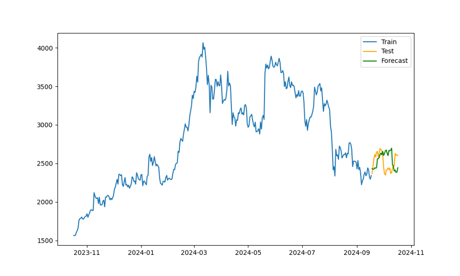

# ModSysLab6
### Цель работы
Реализовать на языке программирования Python (или ином языке высокого уровня) модель Хольта-Уинтерса. 

### Постановка задачи
Временной ряда можете взять любой ряд данных, кроме того, который использовать при представлении на лекции, в том числе с сайта Росстата (https://rosstat.gov.ru/folder/10705) или сервисов трейдинга. Параметры и гиперпараметры модели можете хранить также в файле. На выходе программа должна выдавать параметры модель Хольта-Уинтерса и прогноз на один или большее число сезонов (в зависимости от длины временного ряда.

### Краткое описание модели
Модель Хольта-Уинтерса — это один из методов экспоненциального сглаживания, предназначенный для прогнозирования временных рядов с сезонными колебаниями. Модель особенно полезна, когда данные имеют как долгосрочный тренд, так и повторяющиеся сезонные изменения.
  
#### Модель Хольта-Уинтерса существует в двух вариантах:

##### Аддитивная модель: 

Подходит, если амплитуда сезонных колебаний остается постоянной с течением времени.

##### Мультипликативная модель: 

Подходит, если амплитуда сезонных колебаний изменяется пропорционально уровню временного ряда (например, она увеличивается по мере роста данных).
  
Изучив график с данными цены Ether можно прити к выводу, что сезонность не постоянная, а значит нужна мультипликативная модель, сезон из графика виден в районе нескольких месяцев, поэтому параметр будет подбираться соответствующий. 

### Результаты

Лучший вариант, полученный в итоге анализа тренировочного графика:  
`seasonal_periods = 40`  
`alpha = 0.17`  
`beta = 0.11`  
`gamma = 0.12`  
  

